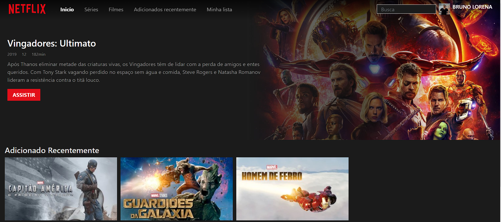
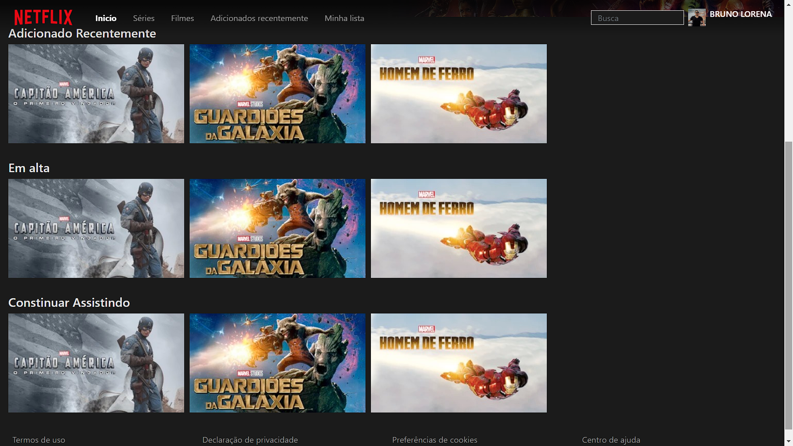

#  CloneNetflix

   

This project was generated with [Angular CLI](https://github.com/angular/angular-cli) version 10.0.4.  

# 💻 Functionalities

This is a project I started to carry out that is a clone of the Netflix APP. In it I separated the main page into components.
The main component "app.component.ts" created an array of objects where I added the titles with their respective parameters.   

## Implementations

✔️ In the nav-bar knowledge of the "ngClass" directive was used, which allows to define a class dynamically from the <strong> DOM </strong> of the element, in this case the <b> {'sidebar-open'} </b>presented in my view <b>(nav-bar.component.html).</b> 

✔️ To create the list of titles presented, first I made an Input of the list and titles that I had created in my <b>"app.component".</b> After that, it was inserted in my view dynamically using <b>"ngFor".</b> 

✔️ In title they were where I had more work. First I made a call through the <b>property viewChid</b> to be able to implement the <b>'trailer'</b> which is a parameter of the <b>'listTitles'object,</b> after that I passed the <b> property 'trailer:'</b>  receives the <b> class ElementRef</b>  and inside I passed an interface element to the <b> HTMLVideoElement</b>  that allowed me manipulate video objects. 
That done I added the functions of <b> play, stop, mute and toggle.</b>   

# 📷 Main Page

 
  

# 🚀 Tecnologies

- TypeScript
- Html
- CSS/ SASS
- JavaScript
  

## Development server

Run `ng serve` for a dev server. Navigate to `http://localhost:4200/`. The app will automatically reload if you change any of the source files.

## Code scaffolding

Run `ng generate component component-name` to generate a new component. You can also use `ng generate directive|pipe|service|class|guard|interface|enum|module`.

## Build

Run `ng build` to build the project. The build artifacts will be stored in the `dist/` directory. Use the `--prod` flag for a production build.

## Running unit tests

Run `ng test` to execute the unit tests via [Karma](https://karma-runner.github.io).

## Running end-to-end tests

Run `ng e2e` to execute the end-to-end tests via [Protractor](http://www.protractortest.org/).

## Further help

To get more help on the Angular CLI use `ng help` or go check out the [Angular CLI README](https://github.com/angular/angular-cli/blob/master/README.md).
